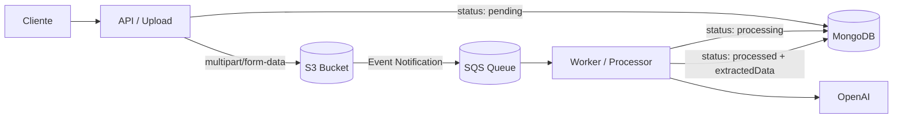

# ms-invoice-processor

Microservicio event-driven para procesamiento automatizado de facturas en formato PDF, con extracción estructurada mediante LLM.
Implementado con arquitectura hexagonal sobre Node.js + TypeScript.

---

## Descripción

Este microservicio permite subir, almacenar y procesar facturas en formato PDF.
Utiliza OpenAI para extraer datos estructurados (folio, RUT, montos, ítems, etc.) y los almacena en MongoDB.

La comunicación entre la API y el worker de procesamiento se realiza de forma asíncrona mediante AWS SQS.

---

## Arquitectura

El proyecto sigue una **arquitectura hexagonal (Ports & Adapters)** organizada como monorepo con pnpm workspaces:

```
src/
├── apps/
│   ├── api/        # HTTP API (subida de facturas)
│   └── worker/     # Consumidor SQS (procesamiento de facturas)
└── packages/
    ├── domain/     # Entidades, puertos y casos de uso
    ├── infra/      # Adaptadores (MongoDB, S3, SQS, OpenAI)
    └── shared/     # Logger y Zod schemas compartidos
```

---

## Diagrama de alto nivel



---

## Boundaries (Hexagonal)

```
┌─────────────────────────────────────────────────────┐
│                      DOMAIN                         │
│                                                     │
│  Entities            Ports (interfaces)             │
│  ────────            ────────────────               │
│  Invoice             InvoiceRepository              │
│                      FileStore                      │
│  UseCases            FileDownloader                 │
│  ──────────          InvoiceDataExtractor           │
│  UploadInvoiceUseCase                               │
│  ProcessInvoiceUseCase                              │
│                                                     │
└──────────────────────┬──────────────────────────────┘
                       │ implements
       ┌───────────────┼───────────────┐
       ▼               ▼               ▼
 ┌──────────┐   ┌──────────────┐  ┌──────────────┐
 │  Mongo   │   │  AWS Infra   │  │  OpenAI LLM  │
 │  Infra   │   │  S3 / SQS    │  │  Extractor   │
 └──────────┘   └──────────────┘  └──────────────┘
       ▲               ▲               ▲
       └───────────────┼───────────────┘
                       │ wired in
               ┌───────────────┐
               │   container   │
               │   (apps)      │
               └───────┬───────┘
                       │
          ┌────────────┴────────────┐
          ▼                         ▼
    ┌──────────┐             ┌──────────────┐
    │   API    │             │    Worker    │
    │  Lambda  │             │    Lambda    │
    └──────────┘             └──────────────┘
```

**Regla de dependencia:** el domain no importa nada de AWS, Mongoose ni OpenAI. Solo TypeScript puro e interfaces. La infra implementa los ports, los apps hacen el wiring en el container.

---

## Estructura del proyecto

```
ms-invoice-processor/
├── src/
│   ├── apps/
│   │   ├── api/
│   │   │   ├── src/
│   │   │   │   ├── controllers/
│   │   │   │   │   └── upload-invoice.controller.ts
│   │   │   │   ├── errors/
│   │   │   │   │   └── http-errors.ts        # HttpError, BadRequestError, etc.
│   │   │   │   ├── handler.ts                # Lambda entry (APIGatewayProxyEventV2)
│   │   │   │   ├── jsend.ts                  # Formato de respuesta JSend
│   │   │   │   ├── local-server.ts           # Servidor Node http para dev local
│   │   │   │   └── router.ts                 # Router mínimo sin Express
│   │   │   ├── .env
│   │   │   └── package.json
│   │   └── worker/
│   │       ├── src/
│   │       │   ├── handler.ts                # SQS Lambda entry
│   │       │   └── local-server.ts           # Simulación SQS local
│   │       ├── .env
│   │       └── package.json
│   └── packages/
│       ├── domain/
│       │   ├── src/
│       │   │   ├── entities/
│       │   │   │   └── invoice.entity.ts     # Invoice, InvoiceStatus, InvoiceEvent
│       │   │   ├── ports/
│       │   │   │   ├── file-downloader.ts
│       │   │   │   ├── file-store.ts
│       │   │   │   ├── invoice-data-extractor.ts
│       │   │   │   └── invoice-repository.ts
│       │   │   ├── usecases/
│       │   │   │   ├── upload-invoice.uc.ts
│       │   │   │   └── process-invoice.uc.ts
│       │   │   └── index.ts
│       │   └── package.json
│       ├── infra/
│       │   ├── src/
│       │   │   ├── aws/
│       │   │   │   ├── s3-file-downloader.ts
│       │   │   │   ├── s3-file-store.ts
│       │   │   │   └── sqs-consumer.ts
│       │   │   ├── inmemory/
│       │   │   │   ├── in-memory-file-store.ts
│       │   │   │   └── in-memory-invoice-repository.ts
│       │   │   ├── llm/
│       │   │   │   └── openai-invoice-extractor.ts
│       │   │   ├── mongodb/
│       │   │   │   ├── invoice.schema.ts
│       │   │   │   └── mongo-invoice-repository.ts
│       │   │   └── index.ts
│       │   └── package.json
│       └── shared/
│           ├── src/
│           │   ├── zod/
│           │   │   └── upload-invoice.schema.ts
│           │   ├── index.ts
│           │   └── logger.ts                 # pino logger factory
│           └── package.json
├── pnpm-workspace.yaml
├── tsconfig.base.json
├── package.json
└── README.md
```

---

## Flujo de procesamiento

```
Cliente
  │
  ▼
POST /invoices/upload  (multipart/form-data)
  │  UploadInvoiceUseCase
  │  • Valida PDF (firma %PDF-, tamaño ≤ 10MB, extensión .pdf)
  │  • Genera UUID
  │  • Sube archivo a S3  →  key: invoices/{uuid}-{fileName}
  │  • Crea Invoice en MongoDB  (status: pending)
  │  • Responde 202 { invoiceId, storageKey }
  │
  ▼
S3 Event Notification  (ObjectCreated:Put)
  │
  ▼
SQS Queue
  │
  ▼
Worker (SQS Consumer)
  │  ProcessInvoiceUseCase
  │  • Extrae invoiceId del key con regex UUID
  │  • Descarga PDF desde S3
  │  • Extrae texto con pdf-parse
  │  • Envía texto a OpenAI (json_object mode + system prompt schema-first)
  │  • Parsea JSON estructurado → ExtractedInvoiceData
  │  • Actualiza Invoice en MongoDB (status: processed + extractedData)
  │
  ▼
MongoDB  (documento final)
```

---

## Idempotencia

SQS garantiza entrega **al menos una vez** — el mismo mensaje puede llegar dos veces. Para evitar reprocesamiento el worker valida el `status` antes de procesar y MongoDB usa `findOneAndUpdate` con `upsert`.

Estados posibles del Invoice:

```
pending → processing → processed
                    → failed
```

El worker extrae el `invoiceId` del S3 key con una regex UUID:

```typescript
const invoiceIdMatch = key.match(
  /invoices\/([0-9a-f]{8}-[0-9a-f]{4}-[0-9a-f]{4}-[0-9a-f]{4}-[0-9a-f]{12})/i
);
const invoiceId = invoiceIdMatch?.[1];
```

---

## Formato de respuestas (JSend)

La API sigue el estándar [JSend](https://github.com/omniti-labs/jsend):

| Tipo      | Cuándo se usa                          |
| --------- | -------------------------------------- |
| `success` | Request procesado correctamente        |
| `fail`    | Error de validación o request inválido |
| `error`   | Error interno del servidor             |

```json
// 202 success
{ "status": "success", "data": { "invoiceId": "uuid", "storageKey": "invoices/uuid-factura.pdf" } }

// 400 fail
{ "status": "fail", "data": { "file": "Invalid PDF signature" } }

// 500 error
{ "status": "error", "message": "Internal Server Error" }
```

---

## Documento Invoice en MongoDB

```json
{
  "id": "80f0dfae-ec51-4058-af68-b5b00c8d4bca",
  "status": "processed",
  "file": {
    "name": "factura.pdf",
    "type": "application/pdf"
  },
  "extractedData": {
    "invoiceNumber": "12345",
    "invoiceType": "Factura Electrónica",
    "date": "2024-03-01",
    "dueDate": null,
    "currency": "CLP",
    "vendor": {
      "name": "Proveedor S.A.",
      "rut": "76.123.456-7",
      "address": "Av. Providencia 123, Santiago",
      "activity": "Servicios de limpieza"
    },
    "client": {
      "name": "Hotel Plaza",
      "rut": "77.654.321-0",
      "address": null
    },
    "lineItems": [
      {
        "description": "Servicio de limpieza mensual",
        "quantity": 1,
        "unitPrice": 1000000,
        "totalPrice": 1000000
      }
    ],
    "subtotal": 1000000,
    "taxRate": 0.19,
    "taxAmount": 190000,
    "totalAmount": 1190000,
    "exentAmount": null,
    "siiResolution": "Res. Ex. SII N°80 del 22-08-2014",
    "observations": null
  },
  "events": [
    {
      "status": "pending",
      "by": "upload-lambda",
      "at": "2024-03-01T10:00:00.000Z"
    },
    {
      "status": "processing",
      "by": "worker-lambda",
      "at": "2024-03-01T10:00:05.000Z"
    },
    {
      "status": "processed",
      "by": "worker-lambda",
      "at": "2024-03-01T10:00:38.000Z"
    }
  ],
  "createdAt": "2024-03-01T10:00:00.000Z"
}
```

---

## Validaciones del PDF

- Firma válida `%PDF-` en el header del archivo
- Tamaño máximo: **10 MB**
- Extensión: debe terminar en `.pdf`
- Nombre sin caracteres inválidos: `\ / : * ? " < > |`

---

## Errores HTTP

| Clase                      | Status | Cuándo                              |
| -------------------------- | ------ | ----------------------------------- |
| `BadRequestError`          | 400    | Request inválido o campos faltantes |
| `NotFoundError`            | 404    | Recurso no encontrado               |
| `UnprocessableEntityError` | 422    | PDF inválido o no procesable        |
| `InternalServerError`      | 500    | Error interno del servidor          |

---

## Requisitos

- Node.js >= 20
- pnpm >= 10
- MongoDB
- AWS account (S3 + SQS)
- API Key de OpenAI

---

## Instalación

```bash
pnpm install
```

---

## Configuración

### API (`src/apps/api/.env`)

```env
PORT=3000
MONGODB_URI=mongodb://localhost:27017/invoices
AWS_REGION=us-east-1
AWS_ACCESS_KEY_ID=your_key
AWS_SECRET_ACCESS_KEY=your_secret
S3_BUCKET_NAME=procureai-invoices-dev
LOG_LEVEL=info
```

### Worker (`src/apps/worker/.env`)

```env
MONGODB_URI=mongodb://localhost:27017/invoices
AWS_REGION=us-east-1
AWS_ACCESS_KEY_ID=your_key
AWS_SECRET_ACCESS_KEY=your_secret
S3_BUCKET_NAME=procureai-invoices-dev
SQS_QUEUE_URL=https://sqs.us-east-1.amazonaws.com/your_account/your_queue
OPENAI_API_KEY=sk-...
OPENAI_MODEL=gpt-4o-mini
LOG_LEVEL=info
```

---

## Comandos

```bash
# Instalar dependencias
pnpm install

# Desarrollo (API + Worker en paralelo)
pnpm dev

# Solo API
pnpm dev:api

# Solo Worker
pnpm dev:worker

# Build todos los packages
pnpm -w build

# Lint
pnpm -w lint

# Tests
pnpm -w test

# Tests en modo watch
pnpm -w test:watch
```

---

## API Reference

### `POST /invoices/upload`

Sube una factura PDF para procesamiento asíncrono.

**Content-Type:** `multipart/form-data`

| Campo    | Tipo   | Requerido | Descripción              |
| -------- | ------ | --------- | ------------------------ |
| file     | File   | ✓         | Archivo PDF (máx. 10 MB) |
| fileName | string | ✓         | Nombre del archivo       |

**Ejemplo:**

```bash
curl -X POST http://localhost:3000/invoices/upload \
  --form 'file=@"/path/to/factura.pdf"' \
  --form 'fileName="factura.pdf"'
```

**Response `202 Accepted`:**

```json
{
  "status": "success",
  "data": {
    "invoiceId": "80f0dfae-ec51-4058-af68-b5b00c8d4bca",
    "storageKey": "invoices/80f0dfae-ec51-4058-af68-b5b00c8d4bca-factura.pdf"
  }
}
```

---

## Stack Tecnológico

| Capa            | Tecnología           |
| --------------- | -------------------- |
| Lenguaje        | TypeScript 5         |
| Runtime         | Node.js 20+          |
| Base de datos   | MongoDB (Mongoose)   |
| Storage         | AWS S3               |
| Mensajería      | AWS SQS              |
| LLM             | OpenAI (gpt-4o-mini) |
| Extracción PDF  | pdf-parse            |
| Validación      | Zod                  |
| Logger          | pino                 |
| Formato HTTP    | JSend                |
| Testing         | Jest + ts-jest       |
| Package manager | pnpm workspaces      |

---

## Decisiones de diseño

**Ports & Adapters** — el domain define interfaces puras y no sabe nada de AWS, Mongoose ni OpenAI. Cambiar de MongoDB a DynamoDB o de OpenAI a Anthropic es cambiar un adapter en infra sin tocar el domain.

**JSend** — formato estándar para respuestas HTTP que distingue entre `success`, `fail` (error del cliente) y `error` (error del servidor). Facilita el manejo de respuestas en el cliente.

**Errores HTTP tipados** — `BadRequestError`, `NotFoundError`, `UnprocessableEntityError` extienden `HttpError` con `statusCode` integrado. El router los captura y formatea la respuesta automáticamente.

**UUID en el S3 key** — `invoices/{uuid}-{fileName}` permite al worker extraer el `invoiceId` directamente del evento S3 sin llamadas extra a la base de datos ni metadata adicional.

**InMemory fallback en el worker** — si `MONGODB_URI` no está definida, el worker usa `InMemoryInvoiceRepository`. Permite correr y testear el worker localmente sin MongoDB.

**json_object mode en OpenAI** — el extractor usa `response_format: { type: 'json_object' }` junto a un system prompt schema-first que describe el JSON esperado. Elimina el parseo frágil de texto libre y garantiza JSON válido en la respuesta.

**Procesamiento asíncrono** — la API responde `202 Accepted` inmediatamente. El procesamiento con el LLM (5-30 segundos) ocurre en el worker sin bloquear el request HTTP.

---

## Licencia

MIT
